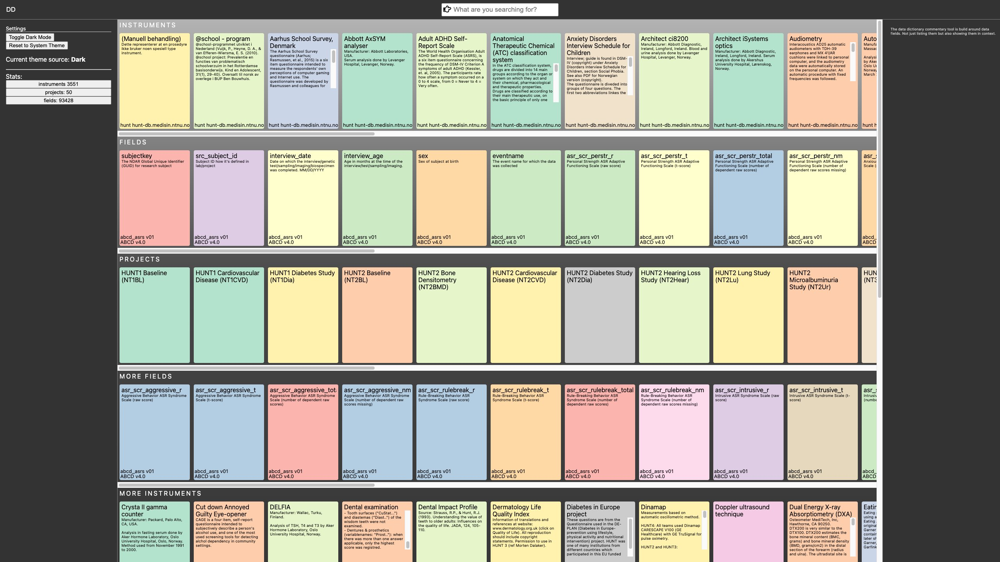

# dd - Data Dictionaries

A data dictionary describes data collections. Spreadsheets containing data might only contain abbreviations as column headers. A data dictionary is a separate table that describes the column headers of the data table. Each variable as a row lists the form they are collected in, the permissible value range, coding information about the meaning of categorical values and information about visibility during data capture. Data dictionary information is machine readable and can be used to verify a dataset or to generate toy data.

### Data dictionary discovery

We propose a distributed architecture where data dictionaries locations are represented by URL's using a coding prefix. In order to identify the coding of such a URL we will use an URI schema coding for project/version/instrument/version:

- URI: "redcap://ABCD?instrument=abcd_abcls&release=v4.0&version=v01"
- URL: "https://raw.githubusercontent.com/HaukeBartsch/dd/main/abcd-4.0-data-dictionaries/abcd_abcls01.csv"

In order to provide such discovery information we will host a file in this repository that includes some examples.

