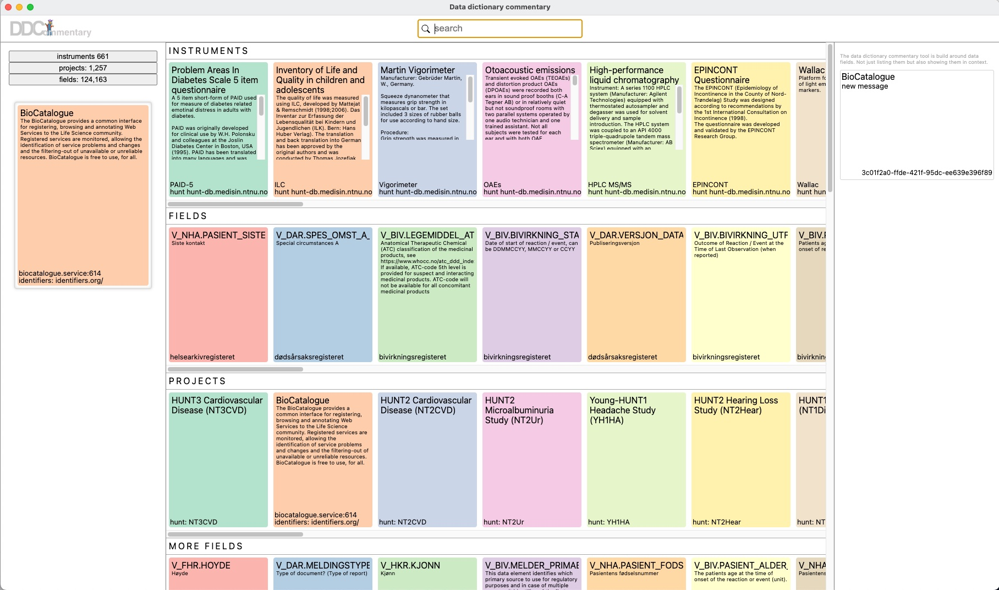

# dd - Data Dictionaries

A data dictionary describes data about data. Many data spreadsheets only contain abbreviations as column headers. A data dictionary is a separate table with each variable as a row described by features like the form they are collected in as context, permissible value ranges, coding information about the meaning of categorical values etc.. The value of a data dictionary is that it provides a machine readable format for describing a data collection.

### Data dictionary discovery

We propose a distributed architecture where data dictionaries locations are represented by URL's using a coding prefix. In order to identify the coding of such a URL we will use an URI schema coding for project/version/instrument/version:

- URI: "redcap://ABCD?instrument=abcd_abcls&release=v4.0&version=v01"
- URL: "https://raw.githubusercontent.com/HaukeBartsch/dd/main/abcd-4.0-data-dictionaries/abcd_abcls01.csv"

In order to provide such discovery information we will host a file in this repository that includes some examples.

